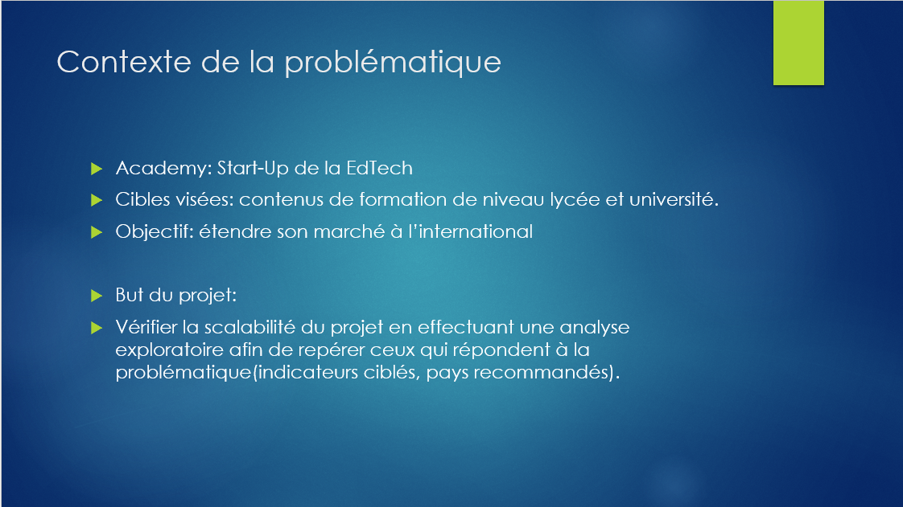
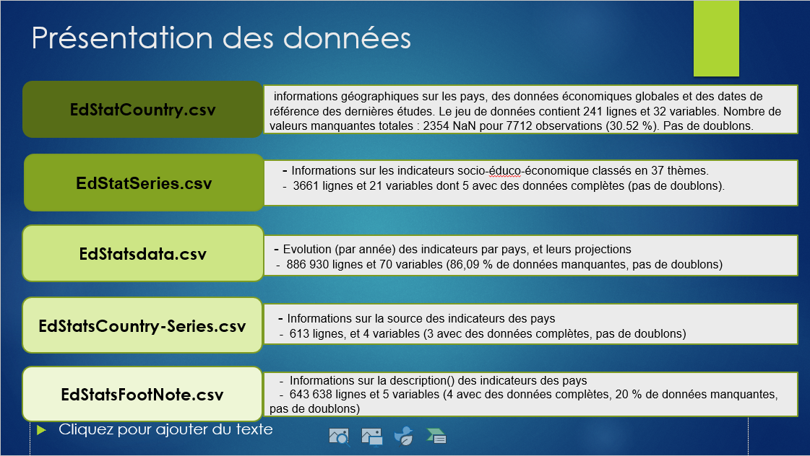
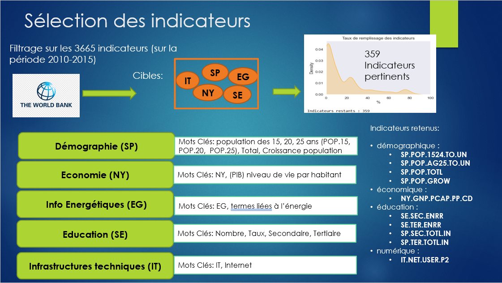
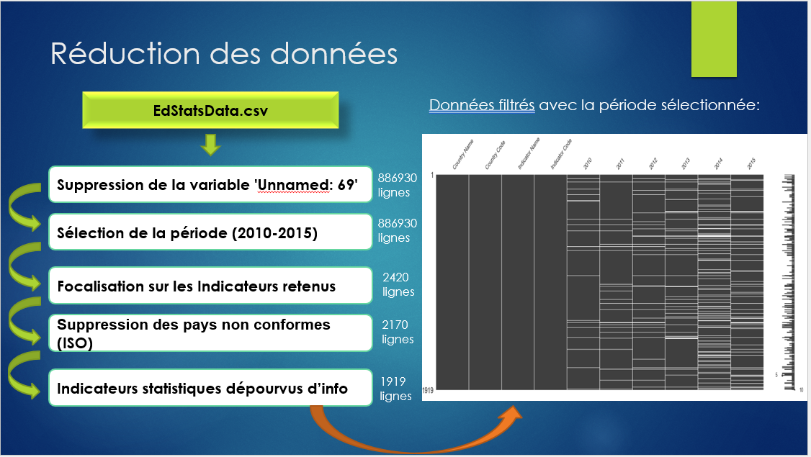
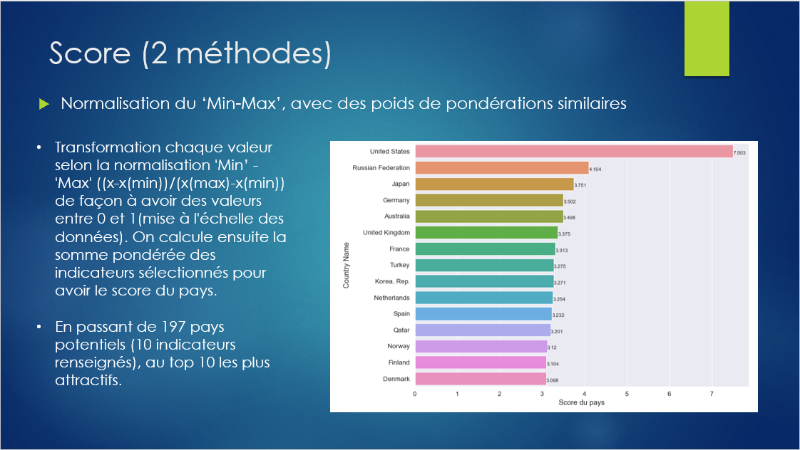
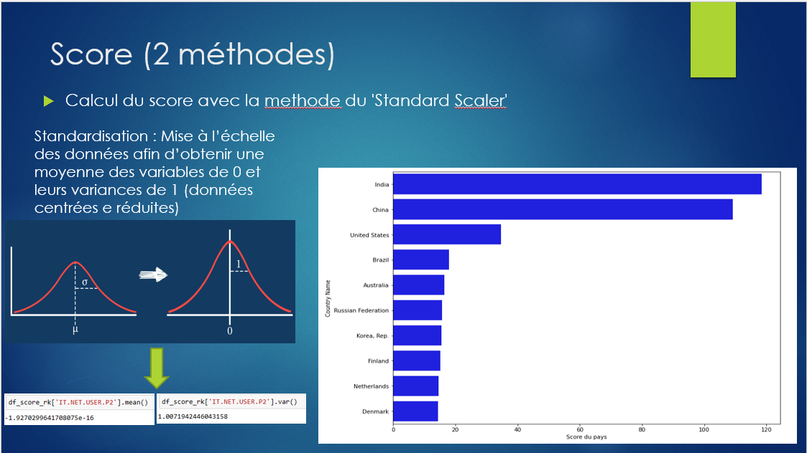
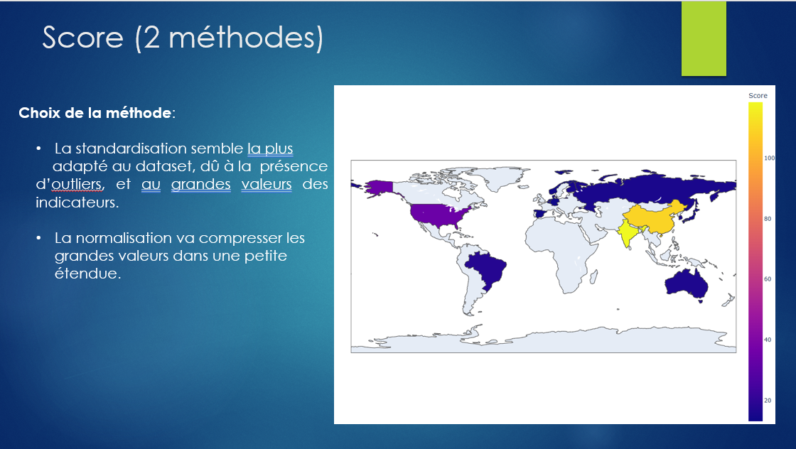
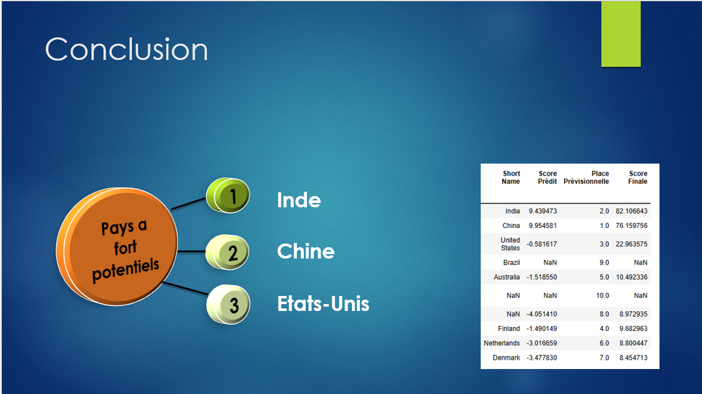

# Analyse des Données de Systèmes Éducatifs  

---

## **Objectif du Projet**  

Ce projet vise à explorer des données éducatives et socio-économiques provenant de la Banque Mondiale pour identifier les pays présentant un fort potentiel d'adoption des solutions proposées par **Academy**, une start-up de la EdTech.  

**Objectifs principaux :**
- Vérification de la scalabilité du projet à l’international  
- Identification des pays cibles à fort potentiel  
- Analyse exploratoire des indicateurs éducatifs, démographiques, économiques et techniques  

---

## **Sources de Données**  

Les jeux de données utilisés proviennent de [World Bank Data Catalog](https://datacatalog.worldbank.org/search/dataset/education-statistics).  

### **Détails des jeux de données :**
1. **EdStatCountry.csv** : Informations géographiques sur les pays  
2. **EdStatSeries.csv** : Description des indicateurs socio-éducatifs  
3. **EdStatsData.csv** : Évolution des indicateurs par pays  
4. **EdStatsCountry-Series.csv** : Sources des indicateurs des pays  
5. **EdStatsFootNote.csv** : Métadonnées sur les indicateurs  

---

## **Sélection et Filtrage des Données**  

### **Étapes de sélection :**
1. **Plage temporelle** : 2010 à 2015  
2. **Filtrage des indicateurs** : Sur les 3665 disponibles, seuls 359 sont retenus  
3. **Types d'indicateurs sélectionnés :**
   - **Démographiques (SP)** : Croissance de la population, jeunes de 15 à 25 ans  
   - **Économiques (NY)** : PIB par habitant  
   - **Éducation (SE)** : Taux d’inscription secondaire et tertiaire  
   - **Numériques (IT)** : Utilisateurs d'Internet  

### **Exemples d'indicateurs :**
- Démographie : `SP.POP.TOTL`, `SP.POP.GROW`  
- Économie : `NY.GNP.PCAP.PP.CD`  
- Éducation : `SE.SEC.ENRR`, `SE.TER.ENRR`  
- Numérique : `IT.NET.USER.P2`  

---

## **Réduction et Nettoyage des Données**  

### **Étapes principales :**  
1. Suppression des variables inutiles (`Unnamed: 69`)  
2. Filtrage sur la période 2010-2015  
3. Suppression des pays non conformes  
4. Focalisation sur les 359 indicateurs pertinents  

### **Résumé final des données :**
- Taille initiale : 886 930 lignes  
- Taille après filtrage : 1919 lignes  

---

## **Analyse Statistique et Scoring**  

### **Méthodes utilisées :**  
1. **Normalisation Min-Max** : Mise à l'échelle des valeurs entre 0 et 1  
   - Calcul d'une somme pondérée des indicateurs  
2. **Standard Scaler** : Centrage-réduction pour obtenir une moyenne de 0 et une variance de 1  
   - Choix privilégié en raison de la présence de valeurs extrêmes  

---

## **Prévisions et Recommandations**  

### **Top 3 des pays à fort potentiel** :
1. Inde  
2. Chine  
3. États-Unis  

Ces pays présentent des caractéristiques favorables pour l’adoption des solutions éducatives proposées par Academy, notamment en termes de connectivité numérique, démographie et infrastructures éducatives.  

---

## **Conclusion et Perspectives**  

### **Résumé :**
- Données nettoyées et analysées  
- Indicateurs pertinents identifiés  
- Méthodologie de scoring efficace  

### **Limites :**
- Fort taux de données manquantes dans certains jeux de données  
- Variabilité importante des projections selon les années  

### **Améliorations possibles :**
1. Inclusion de facteurs socio-culturels supplémentaires  
2. Analyse sur une période temporelle plus large  
3. Prise en compte de l’impact des politiques éducatives locales  

